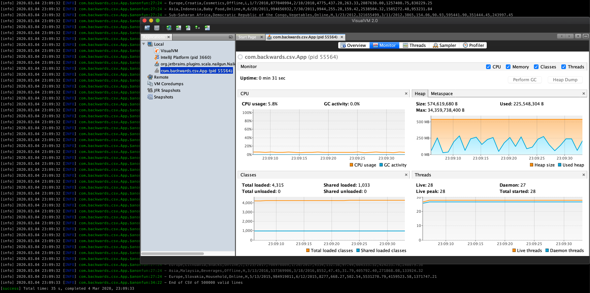

# CSV Parser by Backwards

Scala implementation of CSV parser

## Prerequisites

I'm sure the local environment is set up for Scala/Java, but just in case, for any Mac user (apologies to everyone else):

If you don't have [Homebrew](https://brew.sh/):

```bash
$ /usr/bin/ruby -e "$(curl -fsSL https://raw.githubusercontent.com/Homebrew/install/master/install)"
```

And if you don't have [Java](https://www.java.com/) and/or [SBT](https://www.scala-sbt.org/):

```bash
$ brew install homebrew/cask/java

$ brew install sbt
```

## SBT

From root of this project...

#### Test

```bash
$ sbt clean coverage test
```

#### Generate coverage reports

```bash
$ sbt coverageReport
```

#### Run

When **running** provide the **csv** file and any optional arguments as follows:

- **--csv** or **-c** the path (relative/absolute) of the csv file e.g.

  --csv=src/main/resources/my-input.csv

- **--header** or **-h** optional true/false indicating whether the csv includes a header (default is **false**) e.g.

  --header=true
  
- **--quote** or **-q** optional quote allowing for a line to span multiple lines (default is **""**) e.g.

  --quote='

- **--fieldDelimiter** or **-f** optional marker between fields (default is **,**) e.g.

  --fieldDelimiter=;

- **--lineDelimiter** or **-l** optional marker between lines (default is **\n**) e.g.

  --lineDelimiter=\r\n

There are some example [csv files](src/main/resources) which can be used to run (showing use of overriding command arguments) e.g.

```bash
sbt 'run --csv=src/main/resources/includes-header.csv --header=true'
```

```bash
sbt 'run -c=src/main/resources/excludes-header.csv --fieldDelimiter=";"'
```

NOTE that the last example **quoted** the field delimiter. Any of the argument values can be quoted in case they have special meaning e.g. **;** (the semicolon) separates command line arguments.

Finally, here is an example running against a large CSV:

```bash
sbt 'run --csv=src/main/resources/500000-sales-records.csv --header=true'
```

